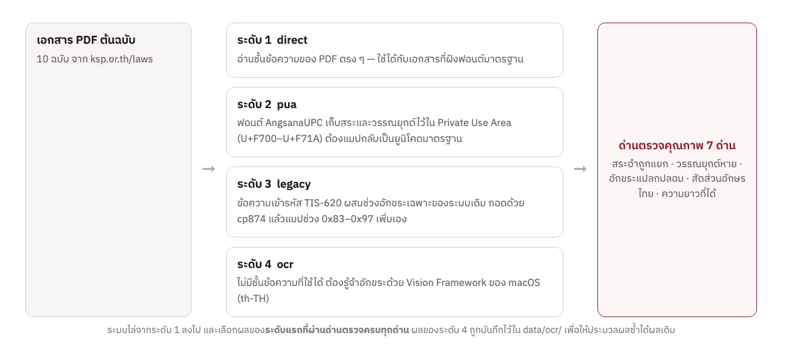
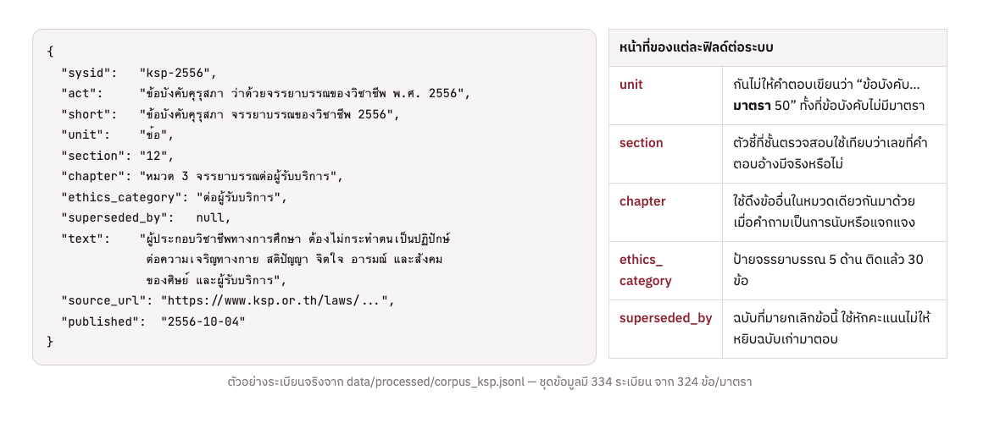
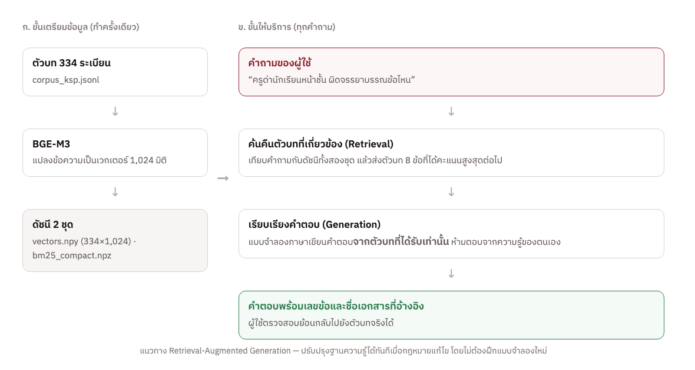
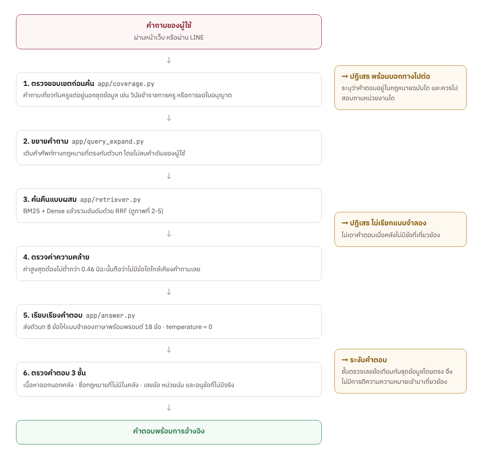
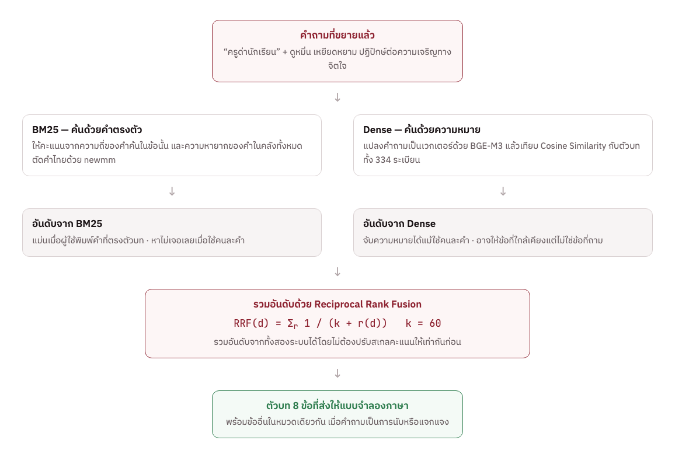
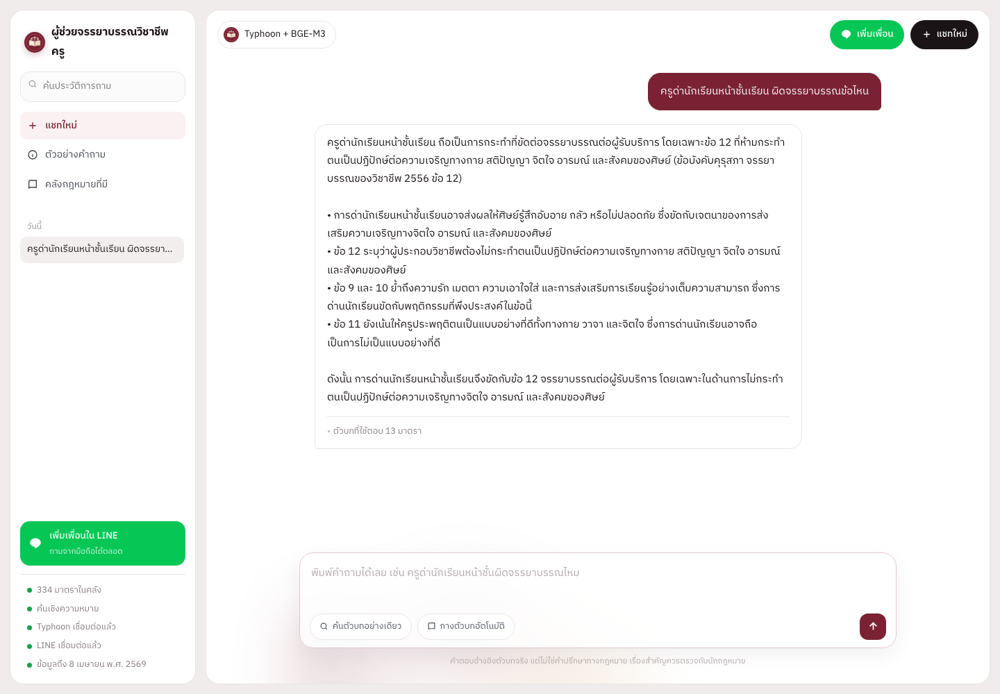
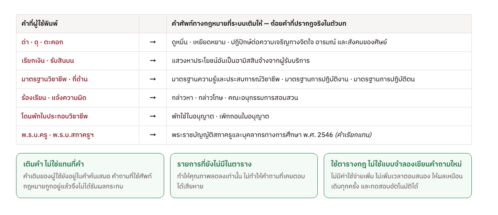
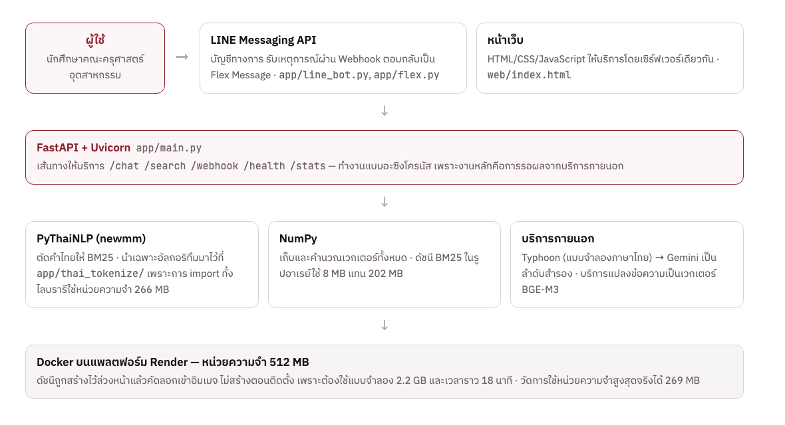

# บทที่ 2 ทฤษฎีที่เกี่ยวข้อง

ในการวิจัยเรื่อง การพัฒนาระบบแชทบอทตอบคำถามกฎหมายจรรยาบรรณวิชาชีพครู คณะครุศาสตร์อุตสาหกรรม มหาวิทยาลัยเทคโนโลยีพระจอมเกล้าพระนครเหนือ ผู้วิจัยได้ศึกษาแนวคิด เอกสาร และงานวิจัยที่เกี่ยวข้อง ซึ่งมีรายละเอียดตามลำดับ ดังนี้

2.1  ชุดข้อมูลที่ใช้ (Data set)
2.2  ปัญญาประดิษฐ์ (Artificial Intelligence)
2.3  แบบจำลองภาษาขนาดใหญ่ (Large Language Model)
2.4  แชทบอท (Chatbot)
2.5  การออกแบบพรอมต์ (Prompt Design)
2.6  เทคนิคการเพิ่มความเข้าใจภาษา (Language Understanding Technique)
2.7  เครื่องมือและไลบรารีที่ใช้พัฒนาระบบ

## 2.1  ชุดข้อมูลที่ใช้ (Data set)

### 2.1.1  ความหมายและเหตุผลที่เลือกใช้ตัวบทกฎหมายเป็นชุดข้อมูล

ชุดข้อมูล (Data set) หมายถึง กลุ่มของข้อมูลที่ถูกรวบรวม จัดระเบียบ และจัดเก็บไว้อย่างเป็นระบบ เพื่อให้คอมพิวเตอร์นำไปประมวลผลได้ ในงานที่ใช้ปัญญาประดิษฐ์ คุณภาพของชุดข้อมูลเป็นตัวกำหนดเพดานความถูกต้องของระบบโดยตรง เพราะระบบไม่สามารถให้คำตอบที่ถูกต้องเกินกว่าข้อมูลที่มีอยู่ได้ [17]

ในการวิจัยครั้งนี้ ผู้วิจัยกำหนดให้ชุดข้อมูลเป็นตัวบทกฎหมายฉบับเต็ม ไม่ใช่คู่คำถามและคำตอบที่เขียนขึ้นเอง ด้วยเหตุผลสองประการ ประการแรก คำตอบของระบบต้องอ้างอิงได้ถึงระดับเลขข้อและเลขมาตรา ซึ่งทำได้ก็ต่อเมื่อระบบถือตัวบทจริงอยู่ ประการที่สอง เมื่อกฎหมายมีการแก้ไขเพิ่มเติม ผู้วิจัยสามารถปรับปรุงชุดข้อมูลได้โดยไม่ต้องเขียนคำถามและคำตอบขึ้นใหม่ทั้งหมด

### 2.1.2  แหล่งที่มาและขอบเขตของเอกสาร

ผู้วิจัยรวบรวมเอกสารจากเว็บไซต์สำนักงานเลขาธิการคุรุสภา หมวดกฎหมายและข้อบังคับ (https://www.ksp.or.th/laws/) ซึ่งเป็นแหล่งเผยแพร่อย่างเป็นทางการของหน่วยงานที่กำกับดูแลวิชาชีพทางการศึกษาโดยตรง รวมทั้งสิ้น 10 ฉบับ ดังแสดงในตารางที่ 2-1

**ตารางที่  2-1  เอกสารที่ประกอบเป็นชุดข้อมูลของระบบ**

| ลำดับ | ชื่อเอกสาร | ประกาศเมื่อ | หน่วยนับ | จำนวนข้อ/มาตรา |
|:--|:--|:--|:--|:--|
| 1 | พระราชบัญญัติสภาครูและบุคลากรทางการศึกษา พ.ศ. 2546 | 11 มิ.ย. 2546 | มาตรา | 90 |
| 2 | ข้อบังคับคุรุสภา ว่าด้วยแบบแผนพฤติกรรมตามจรรยาบรรณของวิชาชีพ พ.ศ. 2550 | 27 เม.ย. 2550 | ข้อ | 24 |
| 3 | ข้อบังคับคุรุสภา ว่าด้วยจรรยาบรรณของวิชาชีพ พ.ศ. 2556 | 4 ต.ค. 2556 | ข้อ | 15 |
| 4 | ข้อบังคับคุรุสภา ว่าด้วยการพิจารณาการประพฤติผิดจรรยาบรรณของวิชาชีพ พ.ศ. 2553 | 30 ธ.ค. 2553 | ข้อ | 61 |
| 5 | ข้อบังคับคุรุสภาฯ (ฉบับที่ 2) พ.ศ. 2559 | 25 ส.ค. 2559 | ข้อ | 11 |
| 6 | ข้อบังคับคุรุสภาฯ (ฉบับที่ 3) พ.ศ. 2563 | 22 ก.ย. 2563 | ข้อ | 8 |
| 7 | ข้อบังคับคุรุสภา ว่าด้วยการพิจารณาการประพฤติผิดจรรยาบรรณของวิชาชีพ พ.ศ. 2568 | 30 ก.ค. 2568 | ข้อ | 73 |
| 8 | ข้อบังคับคุรุสภา ว่าด้วยการอุทธรณ์คำวินิจฉัยฯ พ.ศ. 2549 | 15 ธ.ค. 2549 | ข้อ | 28 |
| 9 | ข้อบังคับคุรุสภา ว่าด้วยการอุทธรณ์คำวินิจฉัยฯ (ฉบับที่ 2) พ.ศ. 2569 | 8 เม.ย. 2569 | ข้อ | 8 |
| 10 | ประกาศคณะกรรมการคุรุสภา เรื่อง หลักเกณฑ์และวิธีการได้มาซึ่งคณะอนุกรรมการอุทธรณ์ฯ | 26 มี.ค. 2553 | ข้อ | 6 |
|  | รวม |  |  | 324 |

เอกสารลำดับที่ 4 ถึง 6 เป็นฉบับที่ถูกยกเลิกโดยฉบับลำดับที่ 7 แล้ว แต่ผู้วิจัยยังคงเก็บไว้ในชุดข้อมูล เพราะกรณีที่เกิดขึ้นก่อนวันที่ข้อบังคับฉบับใหม่มีผลบังคับใช้ยังต้องพิจารณาตามฉบับเดิม ระบบจึงบันทึกความสัมพันธ์นี้ไว้ในฟิลด์ superseded_by และหักคะแนนของข้อที่ถูกยกเลิกในขั้นตอนการค้นคืน เพื่อไม่ให้ระบบหยิบฉบับเก่ามาตอบโดยไม่จำเป็น

### 2.1.3  องค์ประกอบของจรรยาบรรณวิชาชีพครู

หัวใจของชุดข้อมูลคือจรรยาบรรณของวิชาชีพตามมาตรา 50 แห่งพระราชบัญญัติสภาครูและบุคลากรทางการศึกษา พ.ศ. 2546 [1] ซึ่งกำหนดมาตรฐานการปฏิบัติตนไว้ 5 ด้าน และข้อบังคับคุรุสภา ว่าด้วยจรรยาบรรณของวิชาชีพ พ.ศ. 2556 [4] ได้ขยายความไว้เป็นรายข้อ ดังนี้

- จรรยาบรรณต่อตนเอง (ข้อ 7) ผู้ประกอบวิชาชีพทางการศึกษาต้องมีวินัยในตนเอง พัฒนาตนเองด้านวิชาชีพ บุคลิกภาพ และวิสัยทัศน์ ให้ทันต่อการพัฒนาทางวิทยาการ เศรษฐกิจ สังคม และการเมืองอยู่เสมอ
- จรรยาบรรณต่อวิชาชีพ (ข้อ 8) ต้องรัก ศรัทธา ซื่อสัตย์สุจริต รับผิดชอบต่อวิชาชีพ และเป็นสมาชิกที่ดีขององค์กรวิชาชีพ
- จรรยาบรรณต่อผู้รับบริการ (ข้อ 9 ถึงข้อ 13) ต้องรัก เมตตา เอาใจใส่ ช่วยเหลือ ส่งเสริม ให้กำลังใจแก่ศิษย์และผู้รับบริการตามบทบาทหน้าที่โดยเสมอหน้า ต้องไม่กระทำตนเป็นปฏิปักษ์ต่อความเจริญทางกาย สติปัญญา จิตใจ อารมณ์ และสังคมของศิษย์ และต้องไม่แสวงหาประโยชน์อันเป็นอามิสสินจ้างจากผู้รับบริการ
- จรรยาบรรณต่อผู้ร่วมประกอบวิชาชีพ (ข้อ 14) พึงช่วยเหลือเกื้อกูลซึ่งกันและกันอย่างสร้างสรรค์ โดยยึดมั่นในระบบคุณธรรม สร้างความสามัคคีในหมู่คณะ
- จรรยาบรรณต่อสังคม (ข้อ 15) พึงประพฤติปฏิบัติตนเป็นผู้นำในการอนุรักษ์และพัฒนาเศรษฐกิจ สังคม ศาสนา ศิลปวัฒนธรรม ภูมิปัญญา สิ่งแวดล้อม รักษาผลประโยชน์ของส่วนรวม และยึดมั่นในการปกครองระบอบประชาธิปไตยอันมีพระมหากษัตริย์ทรงเป็นประมุข
ข้อบังคับคุรุสภา ว่าด้วยแบบแผนพฤติกรรมตามจรรยาบรรณของวิชาชีพ พ.ศ. 2550 ขยายจรรยาบรรณทั้งห้าด้านออกเป็นพฤติกรรมที่พึงประสงค์ (ก) และพฤติกรรมที่ไม่พึงประสงค์ (ข) แยกตามกลุ่มผู้ประกอบวิชาชีพ ได้แก่ ครู ผู้บริหารสถานศึกษา ผู้บริหารการศึกษา และศึกษานิเทศก์ ส่วนนี้มีความสำคัญต่อระบบเป็นพิเศษ เพราะเป็นข้อความที่ระบุพฤติกรรมเป็นรูปธรรม ซึ่งตรงกับลักษณะคำถามที่ผู้ใช้ถามจริง เช่น “ครูดุด่านักเรียนหน้าชั้นผิดจรรยาบรรณหรือไม่” ผู้วิจัยจึงกำหนดฟิลด์ ethics_category ไว้ในชุดข้อมูล เพื่อติดป้ายว่าข้อใดอยู่ในจรรยาบรรณด้านใด ปัจจุบันมีข้อที่ติดป้ายแล้ว 30 ข้อ ครบทั้งห้าด้าน

### 2.1.4  การถอดข้อความจากเอกสาร PDF

เอกสารต้นทางทั้งหมดเป็นไฟล์ PDF ที่สแกนหรือสร้างจากโปรแกรมประมวลผลคำรุ่นเก่า ผู้วิจัยพบว่าการดึงข้อความภาษาไทยออกจากไฟล์เหล่านี้ไม่สามารถใช้วิธีมาตรฐานวิธีเดียวได้ จึงพัฒนาโมดูล thai_pdf_text.py ที่ทำงานเป็นลำดับขั้น 4 ระดับ และเลือกใช้ผลของระดับแรกที่ผ่านเกณฑ์ตรวจสอบคุณภาพ ดังภาพที่ 2-1

**ภาพที่  2-1  ลำดับขั้น 4 ระดับในการถอดข้อความภาษาไทยจากเอกสาร PDF**

สำหรับระดับที่ 4 ผู้วิจัยทดลองใช้ Tesseract OCR ก่อน แต่พบว่าอ่านเลขไทยผิดอย่างเป็นระบบ เช่น อ่าน “๒๕๖๘” เป็น “๒๕๒๐๕” ซึ่งเป็นความผิดพลาดที่ยอมรับไม่ได้ในงานที่ต้องอ้างเลขข้อและปี พ.ศ. จึงเปลี่ยนไปใช้ Vision Framework ของระบบปฏิบัติการ macOS ในโหมดภาษาไทย ซึ่งอ่านเลขไทยได้ถูกต้อง และบันทึกผลไว้ในโฟลเดอร์ data/ocr/ เพื่อให้การประมวลผลซ้ำได้ผลเดิมทุกครั้ง

นอกจากนี้ ผู้วิจัยพบปัญหาเฉพาะของภาษาไทยที่ส่งผลต่อการตัดคำโดยตรง คือสระอำถูกเก็บเป็นอักขระสองตัว ได้แก่ นิคหิตตามด้วยสระอา ซึ่งมนุษย์อ่านว่า “ำ” แต่โปรแกรมตัดคำมองเป็นคนละตัว พบทั้งสิ้น 648 ตำแหน่ง จึงต้องเพิ่มขั้นตอนประกอบสระอำกลับก่อนนำข้อความไปใช้

### 2.1.5  โครงสร้างของชุดข้อมูลที่ได้

ผลลัพธ์คือแฟ้ม corpus_ksp.jsonl รูปแบบ JSON Lines ประกอบด้วย 334 ระเบียน จาก 324 ข้อและมาตรา โดยข้อที่ยาวเกินขนาดที่กำหนดถูกแบ่งเป็นหลายระเบียนและเชื่อมกันด้วยฟิลด์ part ตัวอย่างระเบียนและหน้าที่ของแต่ละฟิลด์แสดงในภาพที่ 2-2

**ภาพที่  2-2  ตัวอย่างระเบียนหนึ่งระเบียนในชุดข้อมูล และหน้าที่ของแต่ละฟิลด์ต่อระบบ**

การแยกฟิลด์ unit ออกมาเป็นสิ่งจำเป็น เพราะระบบต้องไม่เขียนคำตอบว่า “ข้อบังคับคุรุสภา … มาตรา 50” ในเมื่อข้อบังคับไม่มีมาตรา มีแต่ข้อ ความผิดพลาดชนิดนี้ผู้อ่านทั่วไปมองไม่ออก แต่ทำให้ค้นตัวบทตามที่อ้างไม่พบ

### 2.1.6  การตรวจสอบความสมบูรณ์ของชุดข้อมูล

ผู้วิจัยพัฒนาโปรแกรมตรวจสอบ audit_ksp.py แยกต่างหากจากการทดสอบโปรแกรมตามปกติ เพื่อตอบคำถามว่าชุดข้อมูลครบถ้วนหรือไม่ ประกอบด้วยการตรวจ 6 ด้าน ได้แก่ ความต่อเนื่องของเลขข้อ ความครบถ้วนของหมวดและส่วน ความถูกต้องของการติดป้ายจรรยาบรรณทั้งห้าด้าน ความสัมพันธ์ของฉบับที่ยกเลิกกัน ร่องรอยการถอดข้อความผิดพลาด และอัตราการเก็บเนื้อหา

ผลการตรวจสอบพบว่าระบบเก็บเนื้อหาได้ร้อยละ 89 ถึง 97 ต่อฉบับ เมื่อเทียบกับส่วนที่เป็นตัวบทจริง คือนับตั้งแต่ข้อ 1 จนถึงบล็อกลงนาม ส่วนที่ขาดหายเป็นข้อความประเภทหมายเหตุท้ายประกาศและเหตุผลในการประกาศใช้ ซึ่งไม่ใช่ตัวบทที่ใช้อ้างอิง

## 2.2  ปัญญาประดิษฐ์ (Artificial Intelligence)

### 2.2.1  ความหมายของปัญญาประดิษฐ์

ปัญญาประดิษฐ์เป็นนวัตกรรมสำคัญในการช่วยเพิ่มศักยภาพในด้านต่าง ๆ โดยมีกระบวนการที่พัฒนาให้คอมพิวเตอร์มีลักษณะเสมือนมนุษย์ในการคิด การวิเคราะห์ และการเลียนแบบพฤติกรรมของมนุษย์ [9] เป็นกลไกของกิจกรรมที่เกี่ยวข้องกับความคิดมนุษย์ เช่น การตัดสินใจ การแก้ปัญหา และการเรียนรู้ [10] โดยเฉพาะอย่างยิ่งในการพัฒนาระบบแชทบอท ซึ่งถือเป็นรูปแบบของการประยุกต์ใช้ปัญญาประดิษฐ์ที่ใกล้ชิดกับผู้ใช้มากที่สุด

การนำปัญญาประดิษฐ์มาใช้กับแชทบอทช่วยเพิ่มศักยภาพในการให้บริการ ทั้งด้านการศึกษา การบริการลูกค้า การให้คำปรึกษา และการเข้าถึงข้อมูลขนาดใหญ่แบบทันที ช่วยลดภาระงานซ้ำซ้อนของมนุษย์ และยกระดับประสบการณ์ของผู้ใช้ให้เป็นธรรมชาติมากขึ้น

### 2.2.2  การประยุกต์ใช้ปัญญาประดิษฐ์ในระบบที่พัฒนาขึ้น

ผู้วิจัยใช้ปัญญาประดิษฐ์ใน 2 ตำแหน่งของระบบ ซึ่งทำหน้าที่ต่างกันโดยสิ้นเชิง ตำแหน่งแรกคือการแปลงข้อความเป็นเวกเตอร์ เพื่อใช้ค้นคืนตัวบทที่เกี่ยวข้องกับคำถาม และตำแหน่งที่สองคือการเรียบเรียงคำตอบด้วยแบบจำลองภาษาขนาดใหญ่ ซึ่งจะกล่าวถึงในหัวข้อ 2.3 ส่วนการตรวจสอบความถูกต้องของคำตอบนั้นผู้วิจัยเลือกใช้ชุดกฎที่เขียนขึ้นเอง ไม่ใช้ปัญญาประดิษฐ์ เพราะต้องการผลลัพธ์ที่ตรวจสอบย้อนกลับได้และให้ผลเหมือนเดิมทุกครั้ง

### 2.2.3  การแปลงข้อความเป็นเวกเตอร์ด้วยแบบจำลอง BGE-M3

การแปลงข้อความเป็นเวกเตอร์ (Text Embedding) คือการแทนข้อความด้วยชุดตัวเลขที่สะท้อนความหมายของข้อความนั้น ข้อความที่มีความหมายใกล้เคียงกันจะได้เวกเตอร์ที่อยู่ใกล้กันในปริภูมิ ทำให้เปรียบเทียบความใกล้เคียงเชิงความหมายได้แม้ใช้คนละคำ

ผู้วิจัยเลือกใช้แบบจำลอง BGE-M3 [18] ซึ่งรองรับมากกว่า 100 ภาษา รวมถึงภาษาไทย รองรับข้อความยาวถึง 8,192 โทเคน และให้เวกเตอร์ขนาด 1,024 มิติ ระบบแปลงข้อความของตัวบททั้ง 334 ระเบียนไว้ล่วงหน้า และแปลงคำถามของผู้ใช้ด้วยแบบจำลองเดียวกันในขณะให้บริการ ซึ่งต้องเป็นแบบจำลองเดียวกันเท่านั้น เพราะเวกเตอร์ที่มาจากแบบจำลองคนละตัวเปรียบเทียบกันไม่ได้

### 2.2.4  การสร้างคำตอบโดยเสริมด้วยการค้นคืน (Retrieval-Augmented Generation)

ระบบนี้ไม่ได้ฝึกสอนแบบจำลองขึ้นใหม่ แต่ใช้แบบจำลองที่ผ่านการฝึกมาแล้วร่วมกับฐานความรู้ที่ผู้วิจัยจัดเตรียมไว้ แนวทางนี้เรียกว่าการสร้างคำตอบโดยเสริมด้วยการค้นคืน หรือ Retrieval-Augmented Generation (RAG) [19] คือการค้นเอกสารที่เกี่ยวข้องกับคำถามขึ้นมาก่อน แล้วจึงให้แบบจำลองภาษาเรียบเรียงคำตอบจากเอกสารเหล่านั้น ดังภาพที่ 2-3

**ภาพที่  2-3  แนวทาง Retrieval-Augmented Generation ที่ใช้ในระบบ**

แนวทางนี้เหมาะกับงานที่ข้อมูลต้องอ้างอิงได้และมีการแก้ไขเพิ่มเติมอยู่เสมอ เพราะเมื่อกฎหมายมีการแก้ไข ผู้วิจัยเพียงปรับปรุงชุดข้อมูลและสร้างดัชนีใหม่ ไม่ต้องฝึกแบบจำลองใหม่ ซึ่งใช้ทั้งเวลาและทรัพยากรสูงกว่ามาก

## 2.3  แบบจำลองภาษาขนาดใหญ่ (Large Language Model)

### 2.3.1  ความหมายและสถาปัตยกรรม

Large Language Model หรือ LLM คือแบบจำลองภาษาขนาดใหญ่ที่เป็นส่วนหนึ่งของเทคโนโลยีปัญญาประดิษฐ์ โดยใช้โครงข่ายประสาทเทียม (Neural Network) ที่มีสถาปัตยกรรม Transformer [20] เป็นองค์ประกอบสำคัญในการประมวลผลภาษา จัดอยู่ในกลุ่ม Generative AI และ Machine Learning ซึ่งพัฒนาขึ้นเพื่อให้คอมพิวเตอร์ประมวลผลข้อมูลภาษาและสร้างผลลัพธ์ที่มีลักษณะใกล้เคียงกับภาษาที่มนุษย์ใช้ [16]

LLM สามารถนำมาใช้ในการสร้างข้อความ การค้นหาข้อมูล การตอบคำถาม และการสนับสนุนการสื่อสารระหว่างมนุษย์กับระบบคอมพิวเตอร์ อย่างไรก็ตาม ผลลัพธ์ที่ได้จาก LLM อาจไม่ถูกต้องหรือไม่เป็นปัจจุบันในทุกกรณี จึงควรตรวจสอบข้อมูลก่อนนำไปใช้ โดยเฉพาะการประยุกต์ใช้กับข้อมูลที่ต้องการความถูกต้องสูง [16]

### 2.3.2  ปัญหาการสร้างข้อมูลเท็จ (Hallucination)

ข้อจำกัดสำคัญที่สุดของ LLM ต่องานวิจัยนี้คือการสร้างข้อมูลเท็จ (Hallucination) หมายถึงการที่แบบจำลองสร้างข้อความที่อ่านลื่นไหลและน่าเชื่อถือ แต่ไม่มีอยู่จริงในแหล่งข้อมูล [21] ในบริบทของกฎหมาย อาการนี้ปรากฏเป็นการอ้างเลขข้อหรือเลขมาตราที่ไม่มีอยู่ หรือมีอยู่แต่มีเนื้อหาคนละเรื่องกับที่กล่าวอ้าง

ผู้วิจัยเห็นว่าความผิดพลาดชนิดนี้อันตรายกว่าการตอบว่าไม่ทราบ เพราะผู้ใช้ที่ไม่มีตัวบทอยู่ในมือไม่สามารถแยกคำตอบที่ถูกออกจากคำตอบที่ผิดได้เลย การออกแบบระบบจึงให้น้ำหนักกับการป้องกันอาการนี้มากกว่าการเพิ่มความสามารถในการตอบ ดังจะกล่าวถึงในหัวข้อ 2.4.4 และ 2.5.3

### 2.3.3  แบบจำลองที่ใช้ในงานวิจัยนี้

ผู้วิจัยใช้ LLM ทำหน้าที่เรียบเรียงคำตอบจากตัวบทที่ระบบค้นมาให้เท่านั้น ไม่ให้ตอบจากความรู้ภายในของแบบจำลองเอง และกำหนดค่าพารามิเตอร์ temperature เท่ากับ 0 เพื่อให้คำตอบของคำถามเดียวกันมีความคงเส้นคงวา ซึ่งจำเป็นต่อการวัดความถูกต้องอย่างมีระบบ ระบบเรียกใช้แบบจำลองแบบเป็นลำดับสำรอง (Fallback chain) 3 ชั้น ดังตารางที่ 2-2

**ตารางที่  2-2  ลำดับการเรียกใช้แบบจำลองภาษาของระบบ**

| ลำดับ | แบบจำลอง | เหตุผลที่เลือก |
|:--|:--|:--|
| 1 | Typhoon v2.5 (30B) | แบบจำลองภาษาไทยโดยเฉพาะ [22] เข้าใจโครงสร้างประโยคและคำศัพท์ทางกฎหมายไทยได้ดีกว่าแบบจำลองทั่วไป |
| 2 | Typhoon v2.1 (12B) | ใช้เมื่อชั้นที่ 1 ไม่ตอบสนอง ขนาดเล็กกว่าแต่ยังเป็นแบบจำลองภาษาไทย |
| 3 | Google Gemini | ใช้เมื่อสองชั้นแรกไม่ตอบสนอง ช่วยให้ระบบยังให้บริการได้ต่อเนื่อง |

การออกแบบเป็นลำดับสำรองนี้มีเหตุผลจากการใช้งานจริง คือบริการแบบจำลองภายนอกอาจตอบกลับด้วยรหัสความผิดพลาด 503 Service Unavailable ในบางช่วงเวลา หากระบบพึ่งพาแบบจำลองเดียว ผู้ใช้จะไม่ได้รับคำตอบเลย ทั้งสามแบบจำลองเรียกใช้ผ่านโพรโทคอลเดียวกัน ระบบจึงเปลี่ยนชั้นที่ใช้งานได้โดยไม่ต้องแก้โครงสร้างของโปรแกรม

## 2.4  แชทบอท (Chatbot)

### 2.4.1  ความหมายและประเภทของแชทบอท

ระบบโต้ตอบการสนทนา (Chatbot) คือซอฟต์แวร์ที่มีปฏิสัมพันธ์ทางตัวอักษรหรือคำพูดกับผู้ใช้ผ่านทางภาษา ถูกออกแบบให้ลอกเลียนแบบปฏิสัมพันธ์โดยทั่วไปของมนุษย์ เพื่อช่วยตอบกลับการสนทนาผ่านข้อความหรือเสียงแบบอัตโนมัติและรวดเร็ว [11] พัฒนามาจากปัญญาประดิษฐ์หรือวิทยาศาสตร์คอมพิวเตอร์ในการสร้างการปฏิบัติงานที่มีความฉลาดคล้ายมนุษย์ [12]

การตอบกลับของแชทบอทตามระบบการทำงานมี 2 รูปแบบ ได้แก่ รูปแบบที่ 1 Rule-Based Chatbot ซึ่งประมวลผลคำตอบตามคีย์เวิร์ดที่กำหนดไว้ล่วงหน้า และรูปแบบที่ 2 AI Chatbot ซึ่งนำเทคโนโลยีปัญญาประดิษฐ์มาใช้ ทำให้ตอบคำถามที่ซับซ้อนมากขึ้นได้ [13] โดยองค์ประกอบของแชทบอทประกอบด้วยแหล่งข้อมูลหรือฐานข้อมูล แพลตฟอร์มสำหรับเก็บข้อมูลขนาดใหญ่ และส่วนต่อประสานกับผู้ใช้ [14] ระบบที่ผู้วิจัยพัฒนาขึ้นจัดอยู่ในรูปแบบที่ 2

### 2.4.2  ขั้นตอนการทำงานของระบบ

ระบบมีขั้นตอนการทำงานตั้งแต่รับคำถามจนถึงส่งคำตอบทั้งสิ้น 6 ขั้นตอน โดยมี 3 จุดที่ระบบอาจปฏิเสธหรือระงับคำตอบแทนการเดา ดังภาพที่ 2-4

**ภาพที่  2-4  ขั้นตอนการทำงานของระบบตั้งแต่รับคำถามจนถึงส่งคำตอบ**

### 2.4.3  การค้นคืนแบบผสม (Hybrid Retrieval)

ผู้วิจัยเลือกใช้การค้นคืนสองวิธีควบคู่กัน เพราะแต่ละวิธีมีจุดอ่อนที่อีกวิธีชดเชยได้ วิธีแรกคือ BM25 ซึ่งเป็นฟังก์ชันจัดอันดับเชิงสถิติที่ให้คะแนนเอกสารจากความถี่ของคำค้นในเอกสารและความหายากของคำนั้นในคลังทั้งหมด [23] จุดแข็งคือแม่นยำมากเมื่อผู้ใช้พิมพ์คำที่ตรงกับตัวบท จุดอ่อนคือหาไม่พบเลยเมื่อผู้ใช้ใช้คำอื่น วิธีที่สองคือการค้นด้วยเวกเตอร์ (Dense Retrieval) ซึ่งเปรียบเทียบความใกล้เคียงด้วยค่า Cosine Similarity จุดแข็งคือจับความหมายได้แม้ใช้คนละคำ จุดอ่อนคืออาจให้ข้อที่ความหมายใกล้เคียงแต่ไม่ใช่ข้อที่ถาม

การรวมผลลัพธ์ใช้วิธี Reciprocal Rank Fusion (RRF) [24] ซึ่งรวมอันดับจากหลายระบบโดยไม่ต้องปรับสเกลคะแนนให้เท่ากันก่อน โดยคะแนนรวมของเอกสารหนึ่ง ๆ เท่ากับผลบวกของส่วนกลับของอันดับที่เอกสารนั้นได้รับจากแต่ละระบบ บวกด้วยค่าคงที่ k ซึ่งงานวิจัยนี้กำหนดเป็น 60 ตามค่าที่ใช้ทั่วไป จากนั้นระบบส่งตัวบท 8 ข้อที่ได้คะแนนสูงสุดให้แบบจำลองภาษาใช้เรียบเรียงคำตอบ ดังภาพที่ 2-5

**ภาพที่  2-5  การค้นคืนแบบผสมและการรวมอันดับด้วย Reciprocal Rank Fusion**

ในกรณีที่คำถามเป็นการนับหรือแจกแจง เช่น “จรรยาบรรณต่อผู้รับบริการมีกี่ข้อ” ระบบจะดึงข้ออื่นที่อยู่ในหมวดเดียวกันมาด้วย เพราะการค้นคืนตามความคล้ายเพียงอย่างเดียวมักได้ข้อที่ตรงที่สุดเพียงข้อเดียว ซึ่งทำให้คำตอบนับจำนวนผิด

### 2.4.4  กลไกการปฏิเสธคำถามนอกขอบเขต

แชทบอทที่ตอบทุกคำถามคือแชทบอทที่เดาเมื่อไม่รู้ ผู้วิจัยจึงออกแบบให้ระบบปฏิเสธอย่างชัดเจน 2 จังหวะ จังหวะแรกคือก่อนค้นคืน ระบบตรวจคำถามด้วยชุดกฎ คำถามที่เกี่ยวกับครูแต่อยู่นอกชุดข้อมูล เช่น วินัยข้าราชการครู การขอใบอนุญาตประกอบวิชาชีพ หรือค่าชดเชยของครูอัตราจ้าง จะถูกปฏิเสธพร้อมระบุว่าคำตอบอยู่ในกฎหมายฉบับใดและควรไปสอบถามที่ใด เพราะการปฏิเสธที่ไม่บอกทางไปต่อไม่ได้ช่วยผู้ใช้

จังหวะที่สองคือหลังค้นคืน หากค่า Cosine Similarity สูงสุดต่ำกว่าเกณฑ์ที่ปรับตั้งไว้ที่ 0.46 แสดงว่าไม่มีข้อใดในชุดข้อมูลใกล้เคียงกับคำถามเลย ระบบจะปฏิเสธโดยไม่เรียกแบบจำลองภาษา ซึ่งนอกจากป้องกันการเดาแล้วยังประหยัดค่าใช้จ่ายและเวลาตอบสนองด้วย

### 2.4.5  ช่องทางให้บริการ

ระบบให้บริการผ่านสองช่องทาง ได้แก่ แอปพลิเคชัน LINE ซึ่งเป็นช่องทางหลัก และหน้าเว็บสำหรับผู้ที่ไม่สะดวกใช้ LINE และสำหรับการทดสอบในขั้นพัฒนา ทั้งสองช่องทางเรียกใช้เครื่องแม่ข่ายเดียวกัน จึงให้คำตอบตรงกันเสมอ ตัวอย่างการใช้งานผ่านหน้าเว็บแสดงในภาพที่ 2-6

**ภาพที่  2-6  ตัวอย่างการใช้งานระบบผ่านหน้าเว็บ พร้อมคำตอบที่อ้างอิงเลขข้อและชื่อเอกสาร**

## 2.5  การออกแบบพรอมต์ (Prompt Design)

### 2.5.1  ความหมายของการออกแบบพรอมต์

พรอมต์ (Prompt) คือข้อความสั่งการที่ผู้พัฒนาส่งให้แบบจำลองภาษาเพื่อกำหนดบทบาท ขอบเขต และรูปแบบของผลลัพธ์ การออกแบบพรอมต์ (Prompt Design หรือ Prompt Engineering) จึงเป็นการกำหนดพฤติกรรมของแบบจำลองโดยไม่ต้องฝึกสอนใหม่ [25] ผลลัพธ์ที่ได้ขึ้นอยู่กับความชัดเจนของคำสั่ง การระบุสิ่งที่ไม่ต้องการให้ตอบ และการจัดลำดับความสำคัญของข้อกำหนด

### 2.5.2  พรอมต์ของระบบที่พัฒนาขึ้น

พรอมต์ของระบบประกอบด้วยข้อกำหนด 18 ข้อ สาระสำคัญแบ่งได้เป็น 4 กลุ่ม ดังนี้

- กลุ่มที่ 1 ขอบเขตของแหล่งข้อมูล ให้ตอบจากตัวบทที่แนบมาให้เท่านั้น ห้ามตอบจากความรู้ของแบบจำลองเอง หากตัวบทที่ได้รับไม่มีคำตอบ ให้ตอบว่าไม่มีข้อกำหนดในเรื่องนั้น แทนการเดา
- กลุ่มที่ 2 ความถูกต้องของการอ้างอิง ต้องระบุชื่อเอกสาร หน่วยนับ และเลขข้อทุกครั้ง และต้องใช้หน่วยนับให้ตรงชนิดของเอกสาร คือ “ข้อ” สำหรับข้อบังคับ และ “มาตรา” สำหรับพระราชบัญญัติ
- กลุ่มที่ 3 ความซื่อตรงต่อถ้อยคำของกฎหมาย ต้องรักษาคำว่า “พึง” และ “ต้อง” ตามที่ตัวบทเขียนไว้ เพราะสองคำนี้มีผลทางกฎหมายต่างกัน คำว่า “ต้อง” คือข้อบังคับที่ฝ่าฝืนแล้วมีโทษ ส่วนคำว่า “พึง” คือข้อพึงปฏิบัติ การเปลี่ยน “พึง” เป็น “ต้อง” ในคำตอบจึงเป็นการรายงานกฎหมายผิดไปจากที่เขียนไว้
- กลุ่มที่ 4 ความถูกต้องของกลุ่มผู้ประกอบวิชาชีพ ข้อบังคับฯ พ.ศ. 2550 แยกแบบแผนพฤติกรรมของครู ผู้บริหารสถานศึกษา ผู้บริหารการศึกษา และศึกษานิเทศก์ไว้คนละหมวด คำตอบต้องใช้ข้อของกลุ่มที่ผู้ใช้ถามถึงเท่านั้น
### 2.5.3  ข้อจำกัดของการออกแบบพรอมต์และชั้นตรวจสอบด้วยกฎ

ผู้วิจัยพบจากการทดสอบซ้ำหลายรอบว่าคำสั่งในพรอมต์เพียงอย่างเดียวไม่เพียงพอ ข้อกำหนดบางข้อที่แก้ปัญหาได้ในรอบหนึ่ง กลับเกิดปัญหาเดิมซ้ำในรอบถัดไป เพราะแบบจำลองภาษาไม่ได้ปฏิบัติตามคำสั่งอย่างเป็นกลไก ผู้วิจัยจึงเพิ่มชั้นตรวจสอบที่ทำงานด้วยกฎ (Rule-based Verification) หลังแบบจำลองสร้างคำตอบแล้ว โดยตรวจเฉพาะสิ่งที่พิสูจน์ได้จากชุดข้อมูลโดยตรง 3 ชั้น ได้แก่

- ชั้นที่ 1 ตรวจเนื้อหาที่ออกนอกคลัง ว่าคำตอบกล่าวถึงกฎหมายที่ระบบไม่มีหรือไม่
- ชั้นที่ 2 ตรวจชื่อกฎหมายที่อ้าง ว่าชื่อเอกสารนั้นมีอยู่ในชุดข้อมูลหรือไม่
- ชั้นที่ 3 ตรวจเลขข้อที่อ้าง ว่าเลขข้อนั้นมีอยู่ในเอกสารที่อ้างหรือไม่ หน่วยนับตรงชนิดของเอกสารหรือไม่ และอนุข้อที่ชี้ถึงอยู่ในบล็อกที่ระบุจริงหรือไม่
ชั้นที่ 3 เป็นการตรวจเชิงโครงสร้างที่เทียบกับชุดข้อมูลโดยตรง จึงไม่มีการตีความความหมายเข้ามาเกี่ยวข้อง และเป็นชั้นเดียวที่ระบบยอมให้ระงับคำตอบได้ ส่วนการตรวจว่าข้อความที่อ้างสอดคล้องกับเนื้อหาของข้อที่อ้างหรือไม่นั้น ผู้วิจัยพัฒนาไว้แล้วแต่ยังไม่เปิดใช้งาน เพราะจากการวัดพบว่ายังระงับคำตอบที่ถูกต้องในอัตราที่สูงเกินกว่าประโยชน์ที่ได้

## 2.6  เทคนิคการเพิ่มความเข้าใจภาษา (Language Understanding Technique)

เทคนิคการเพิ่มความเข้าใจภาษาเป็นเทคนิคประมวลผลภาษาธรรมชาติที่ทำให้ระบบเข้าใจความหมายของภาษาที่มนุษย์ใช้ ไม่ใช่เพียงการจับคำตรงตัว ช่วยให้ผู้ใช้ไม่ต้องพิมพ์ตามประโยคตายตัว ในงานวิจัยนี้ผู้วิจัยใช้เทคนิค 3 อย่างร่วมกัน ได้แก่ การจัดการคำเรียกแทน การจัดการคำพ้องความหมาย และการตัดคำภาษาไทย

### 2.6.1  คำเรียกแทน (Alias)

คำเรียกแทน (Alias) หมายถึงชื่อหรือคำที่ใช้เรียกสิ่งเดียวกันแทนชื่อที่เป็นทางการ ในระบบค้นคืนข้อมูล การจัดการคำเรียกแทนมีความสำคัญ เพราะผู้ใช้มักไม่ทราบชื่อทางการของสิ่งที่ตนถามถึง [26] หากระบบไม่เชื่อมคำเรียกแทนกลับไปยังสิ่งเดียวกัน ระบบจะตีความว่าเป็นคนละสิ่ง

ในบริบทของงานวิจัยนี้ ปัญหาคำเรียกแทนปรากฏใน 2 ลักษณะ ลักษณะที่ 1 คือชื่อย่อของเอกสาร ผู้ใช้เรียกพระราชบัญญัติสภาครูและบุคลากรทางการศึกษา พ.ศ. 2546 ว่า “พ.ร.บ.สภาครูฯ” หรือ “พ.ร.บ.ครู” ระบบจึงเก็บทั้งชื่อเต็มและชื่อย่ออย่างเป็นทางการไว้ในทุกระเบียนของชุดข้อมูล ลักษณะที่ 2 คือชื่อเรียกกลุ่มผู้ประกอบวิชาชีพ กฎหมายใช้คำว่า “ผู้ประกอบวิชาชีพทางการศึกษา” ขณะที่ผู้ใช้พิมพ์ว่า “ครู” และกฎหมายใช้คำว่า “ผู้รับบริการ” ขณะที่ผู้ใช้พิมพ์ว่า “นักเรียน” หรือ “ศิษย์”

ผู้วิจัยพบจากการทดสอบว่า การจับคู่ด้วยชื่ออย่างเดียวไม่เพียงพอ เพราะแบบจำลองภาษาย่อชื่อเอกสารด้วยถ้อยคำของตนเอง เช่น เขียนว่า “แบบแผนพฤติกรรม 2550” ซึ่งไม่ตรงกับชื่อใดในชุดข้อมูล ทำให้ชั้นตรวจสอบจับคู่ข้ออ้างอิงเข้ากับเอกสารผิดฉบับ จึงต้องเพิ่มการจับคู่ด้วยเลขปี พ.ศ. ควบคู่ไปกับชื่อ เนื่องจากเอกสารทั้งสิบฉบับในชุดข้อมูลมีปีประกาศไม่ซ้ำกัน เลขปีเพียงตัวเดียวจึงระบุฉบับได้อย่างไม่กำกวม

### 2.6.2  คำพ้องความหมาย (Synonyms)

คำพ้องความหมาย (Synonyms) หมายถึงคำที่เขียนต่างกันแต่สื่อความหมายเดียวกันหรือใกล้เคียงกัน ในระบบค้นคืนข้อมูล ปัญหานี้เรียกว่าช่องว่างทางคำศัพท์ (Vocabulary Mismatch) คือผู้ใช้และเอกสารใช้คนละคำเพื่อสื่อเรื่องเดียวกัน ทำให้การค้นด้วยคำตรงตัวหาไม่พบ [26]

ผู้วิจัยพบว่าปัญหานี้เป็นสาเหตุอันดับหนึ่งของความล้มเหลวในการค้นคืนของระบบนี้ เนื่องจากภาษาที่ผู้ใช้ใช้กับภาษาที่กฎหมายใช้ห่างกันมาก ตัวอย่างเช่น ผู้ใช้ถามว่า “ครูด่านักเรียนผิดไหม” แต่ตัวบทเขียนว่า “ดูหมิ่นเหยียดหยาม” และ “กระทำตนเป็นปฏิปักษ์ต่อความเจริญทางจิตใจของศิษย์” ไม่มีข้อใดมีคำว่า “ด่า” อยู่เลย ผู้วิจัยจึงพัฒนาโมดูลขยายคำถามซึ่งเก็บตารางกฎในรูปแบบคำที่ผู้ใช้พิมพ์คู่กับคำศัพท์ทางกฎหมายที่ต้องเติม ดังภาพที่ 2-7

**ภาพที่  2-7  ตัวอย่างการขยายคำถามด้วยคำเรียกแทนและคำพ้องความหมาย**

หลักการสำคัญของการออกแบบคือการเติมคำ ไม่ใช่การแทนที่คำ คำเดิมของผู้ใช้ยังคงอยู่ในคำค้นเสมอ ทำให้คำถามที่ใช้ศัพท์กฎหมายถูกต้องอยู่แล้วไม่ได้รับผลกระทบ และรายการที่ยังไม่มีในตารางจะทำให้คุณภาพลดลงเท่านั้น ไม่ทำให้คำถามที่เคยตอบได้เสียหาย ผู้วิจัยเลือกใช้ตารางกฎแทนการให้แบบจำลองภาษาเขียนคำถามใหม่ ด้วยเหตุผล 4 ประการ คือ ไม่มีค่าใช้จ่ายเพิ่ม ไม่เพิ่มเวลาตอบสนอง ให้ผลเหมือนเดิมทุกครั้งเมื่อคำถามเหมือนเดิม และทดสอบได้ด้วยชุดทดสอบอัตโนมัติ

### 2.6.3  การตัดคำภาษาไทย

ภาษาไทยเขียนติดกันโดยไม่มีช่องว่างระหว่างคำ ระบบค้นคืนที่ใช้คำเป็นหน่วย เช่น BM25 จึงต้องตัดคำก่อนสร้างดัชนี การตัดคำผิดส่งผลโดยตรงต่อผลการค้นคืน เช่น หากตัดคำว่า “จรรยาบรรณ” ผิดเป็น “จรรยา” กับ “บรรณ” การค้นด้วยคำว่า “จรรยาบรรณ” จะไม่พบข้อที่ควรพบ ผู้วิจัยจึงใช้ไลบรารี PyThaiNLP ซึ่งจะกล่าวถึงรายละเอียดในหัวข้อ 2.7.1

## 2.7  เครื่องมือและไลบรารีที่ใช้พัฒนาระบบ

ระบบพัฒนาด้วยภาษาไพทอนทั้งหมด และออกแบบภายใต้ข้อจำกัดหน่วยความจำของเครื่องแม่ข่าย 512 เมกะไบต์ ซึ่งเป็นข้อจำกัดที่กำหนดการเลือกไลบรารีในเกือบทุกจุด ภาพรวมของส่วนประกอบทั้งหมดแสดงในภาพที่ 2-8

**ภาพที่  2-8  ส่วนประกอบของระบบตั้งแต่ส่วนต่อประสานผู้ใช้จนถึงการนำขึ้นให้บริการ**

### 2.7.1  ไลบรารี PyThaiNLP

PyThaiNLP เป็นไลบรารีประมวลผลภาษาธรรมชาติภาษาไทยแบบโอเพนซอร์ส พัฒนาด้วยภาษาไพทอน ครอบคลุมงานพื้นฐานหลายด้าน เช่น การตัดคำ การกำกับชนิดของคำ การแปลงเลขไทย และการจัดการคำหยุด [28] งานวิจัยนี้ใช้อัลกอริทึม newmm ซึ่งเป็นค่าตั้งต้นของไลบรารี เป็นวิธีการจับคู่ยาวสุดแบบใช้พจนานุกรม (Dictionary-based Maximum Matching) ร่วมกับการกำหนดขอบเขตด้วยกลุ่มอักขระไทย (Thai Character Cluster) ข้อดีคือทำงานเร็วและให้ผลเหมือนเดิมทุกครั้ง ซึ่งเหมาะกับการสร้างดัชนีที่ต้องทำซ้ำได้

ผู้วิจัยใช้ PyThaiNLP ใน 2 ขั้นตอน คือขั้นเตรียมข้อมูล ตัดคำตัวบททั้ง 334 ระเบียนเพื่อสร้างดัชนี BM25 และขั้นให้บริการ ตัดคำถามของผู้ใช้ด้วยอัลกอริทึมเดียวกัน ซึ่งจำเป็นต้องเป็นอัลกอริทึมเดียวกัน มิฉะนั้นคำที่ตัดได้จะไม่ตรงกับคำในดัชนี อย่างไรก็ตาม ผู้วิจัยพบว่าการเรียกใช้ไลบรารีทั้งตัวใช้หน่วยความจำถึง 266 เมกะไบต์ ทั้งที่ระบบต้องการเพียงฟังก์ชันตัดคำเท่านั้น จึงนำเฉพาะส่วนอัลกอริทึม newmm มาไว้ในโปรเจกต์ภายใต้สัญญาอนุญาต Apache-2.0 ของไลบรารีต้นทาง และเขียนชุดทดสอบเพื่อยืนยันว่าผลการตัดคำของส่วนที่นำมาตรงกับไลบรารีต้นทางทุกประการ

### 2.7.2  ไลบรารี NumPy

> หมายเหตุถึงผู้เขียน (ลบก่อนส่ง): หัวข้อที่อาจารย์ติ๊กคือ Pandas Library ผู้วิจัยตรวจสอบโค้ดแล้วพบว่า Pandas ถูกใช้เฉพาะในสคริปต์เตรียมข้อมูลของชุดข้อมูลชุดก่อน ไม่ได้ใช้ในสายงานของชุดข้อมูลจรรยาบรรณวิชาชีพครู ไลบรารีที่ทำหน้าที่จัดการข้อมูลจริงในระบบนี้คือ NumPy จึงเขียนตามที่ระบบใช้จริง ถ้าอาจารย์ยืนยันให้คงชื่อเดิม แจ้งได้

NumPy เป็นไลบรารีพื้นฐานสำหรับการคำนวณเชิงตัวเลขในภาษาไพทอน จุดเด่นคือโครงสร้างข้อมูลแบบอาเรย์หลายมิติที่เก็บข้อมูลชนิดเดียวกันต่อเนื่องกันในหน่วยความจำ ทำให้คำนวณกับข้อมูลทั้งชุดได้ในคราวเดียวโดยไม่ต้องวนลูป [27] ซึ่งเร็วกว่าการเขียนลูปในไพทอนหลายเท่า

ระบบใช้ NumPy ใน 3 จุด จุดแรกคือเก็บเวกเตอร์ของตัวบททั้งหมดเป็นเมทริกซ์ขนาด 334 คูณ 1,024 จุดที่สองคือคำนวณค่าความคล้ายระหว่างเวกเตอร์ของคำถามกับตัวบททั้งหมดพร้อมกันด้วยการคูณเมทริกซ์ครั้งเดียว เนื่องจากเวกเตอร์ถูกปรับให้มีความยาวหน่วยแล้ว ผลคูณจุดจึงเท่ากับค่า Cosine Similarity โดยตรง และจุดที่สามคือเก็บดัชนี BM25 ในรูปแบบประหยัดหน่วยความจำ

เหตุผลด้านทรัพยากรเป็นตัวกำหนดการออกแบบส่วนนี้ การเก็บดัชนี BM25 ด้วยไลบรารีสำเร็จรูปในรูปแบบวัตถุที่ผ่านการฝึกแล้วใช้หน่วยความจำ 202 เมกะไบต์ ขณะที่การเก็บข้อมูลชุดเดียวกันเป็นอาเรย์ของ NumPy ใช้เพียง 8 เมกะไบต์ ผู้วิจัยจึงเขียนโมดูลคำนวณคะแนน BM25 จากอาเรย์โดยตรง และวัดการใช้หน่วยความจำสูงสุดของระบบได้ที่ 269 เมกะไบต์ จากเพดาน 512 เมกะไบต์

### 2.7.3  FastAPI และ Uvicorn

FastAPI เป็นเฟรมเวิร์กสำหรับพัฒนาเว็บ API ด้วยภาษาไพทอน ทำงานบนมาตรฐาน ASGI ซึ่งรองรับการทำงานแบบอะซิงโครนัส จุดเด่นคือใช้การประกาศชนิดข้อมูลของไพทอนเพื่อตรวจสอบความถูกต้องของข้อมูลขาเข้าโดยอัตโนมัติ และสร้างเอกสาร API ตามมาตรฐาน OpenAPI ให้เอง [29] ส่วน Uvicorn ทำหน้าที่เป็นเครื่องแม่ข่ายที่รันแอปพลิเคชันนั้น

ระบบเปิดให้บริการ 5 เส้นทาง ได้แก่ /health สำหรับตรวจสถานะระบบ /stats สำหรับดูสถิติของชุดข้อมูล /chat สำหรับรับคำถามและส่งคำตอบ /search สำหรับตรวจสอบผลการค้นคืนในขั้นพัฒนา และ /webhook สำหรับรับเหตุการณ์จาก LINE เหตุผลที่เลือก FastAPI คือลักษณะงานของระบบนี้เป็นการรอผลจากบริการภายนอกเป็นหลัก การทำงานแบบอะซิงโครนัสจึงทำให้เครื่องแม่ข่ายรับคำขอพร้อมกันได้หลายรายการโดยไม่ต้องเพิ่มกระบวนการทำงาน ซึ่งสอดคล้องกับข้อจำกัดหน่วยความจำ

### 2.7.4  LINE Messaging API

LINE Messaging API เป็นชุดบริการที่ให้ผู้พัฒนาสร้างบัญชีทางการ (Official Account) เพื่อรับและส่งข้อความกับผู้ใช้แอปพลิเคชัน LINE โดยอัตโนมัติ ทำงานด้วยกลไก Webhook คือเมื่อผู้ใช้ส่งข้อความ ระบบของ LINE จะส่งข้อมูลเหตุการณ์มายังที่อยู่ที่ผู้พัฒนากำหนดไว้ [30]

ผู้วิจัยเลือกช่องทาง LINE เป็นช่องทางหลัก เนื่องจากกลุ่มผู้ใช้เป้าหมายคือนักศึกษาคณะครุศาสตร์อุตสาหกรรม ซึ่งใช้แอปพลิเคชัน LINE เป็นประจำอยู่แล้ว ไม่ต้องติดตั้งโปรแกรมเพิ่ม ระบบตรวจสอบลายเซ็นของคำขอเพื่อยืนยันว่ามาจาก LINE จริง และจัดรูปแบบคำตอบเป็น Flex Message เพื่อให้ส่วนที่เป็นการอ้างอิงตัวบทแยกออกจากส่วนที่เป็นคำอธิบายอย่างชัดเจน

### 2.7.5  Docker และการนำระบบขึ้นให้บริการ

Docker เป็นเทคโนโลยีที่บรรจุโปรแกรมพร้อมสภาพแวดล้อมที่โปรแกรมต้องใช้ไว้ในอิมเมจเดียวกัน ทำให้โปรแกรมทำงานได้เหมือนกันทุกเครื่อง ผู้วิจัยบรรจุระบบเป็นอิมเมจ Docker และนำขึ้นให้บริการบนแพลตฟอร์ม Render

ผู้วิจัยออกแบบให้ดัชนีถูกสร้างไว้ล่วงหน้าแล้วคัดลอกเข้าไปในอิมเมจ ไม่สร้างตอนติดตั้ง เนื่องจากการสร้างดัชนีต้องใช้แบบจำลอง BGE-M3 ขนาด 2.2 กิกะไบต์ และใช้เวลาประมาณ 18 นาที ซึ่งไม่เหมาะกับสภาพแวดล้อมของเครื่องแม่ข่าย ในขั้นให้บริการ ระบบจึงเรียกใช้บริการแปลงข้อความเป็นเวกเตอร์จากภายนอกที่ใช้แบบจำลองชุดเดียวกัน เพื่อให้เวกเตอร์ของคำถามอยู่ในปริภูมิเดียวกับดัชนีที่สร้างไว้

### 2.7.6  Visual Studio Code และระบบควบคุมเวอร์ชัน

Visual Studio Code เป็นโปรแกรมแก้ไขและปรับแต่งโค้ดแบบโอเพนซอร์สจากบริษัทไมโครซอฟท์ [2] จุดเด่นคือทำงานรวดเร็ว รองรับหลายภาษา มีระบบแนะนำโค้ด การดีบัก และการเชื่อมต่อกับ Git ผู้วิจัยใช้เป็นเครื่องมือหลักในการพัฒนา ร่วมกับ Git และ GitHub สำหรับควบคุมเวอร์ชันของโค้ดและชุดข้อมูล ทำให้ย้อนกลับไปยังรุ่นก่อนหน้าได้เมื่อการแก้ไขทำให้คุณภาพคำตอบลดลง ซึ่งเกิดขึ้นจริงหลายครั้งระหว่างการพัฒนา

## เอกสารอ้างอิงที่เพิ่ม

[16]  (ต้องเติมให้ตรงกับแหล่งที่อ้างไว้เดิมในเนื้อหาเรื่อง LLM — เล่มเดิมอ้าง [16] ไว้แล้ว แต่ยังไม่มีรายการในบรรณานุกรม)

[17]  Gudivada, V., Apon, A., and Ding, J.  (2017).  Data Quality Considerations for Big Data and Machine Learning: Going Beyond Data Cleaning and Transformations.  International Journal on Advances in Software, 10(1), pp. 1–20.

[18]  Chen, J., Xiao, S., Zhang, P., Luo, K., Lian, D., and Liu, Z.  (2024).  M3-Embedding: Multi-Linguality, Multi-Functionality, Multi-Granularity Text Embeddings Through Self-Knowledge Distillation.  Findings of the Association for Computational Linguistics: ACL 2024, pp. 2318–2335.

[19]  Lewis, P., Perez, E., Piktus, A., Petroni, F., Karpukhin, V., Goyal, N., et al.  (2020).  Retrieval-Augmented Generation for Knowledge-Intensive NLP Tasks.  Advances in Neural Information Processing Systems 33, pp. 9459–9474.

[20]  Vaswani, A., Shazeer, N., Parmar, N., Uszkoreit, J., Jones, L., Gomez, A. N., et al.  (2017).  Attention Is All You Need.  Advances in Neural Information Processing Systems 30, pp. 5998–6008.

[21]  Ji, Z., Lee, N., Frieske, R., Yu, T., Su, D., Xu, Y., et al.  (2023).  Survey of Hallucination in Natural Language Generation.  ACM Computing Surveys, 55(12), pp. 1–38.

[22]  SCB 10X.  (2567).  Typhoon: Thai Large Language Model.  สืบค้นจาก https://opentyphoon.ai

[23]  Robertson, S., and Zaragoza, H.  (2009).  The Probabilistic Relevance Framework: BM25 and Beyond.  Foundations and Trends in Information Retrieval, 3(4), pp. 333–389.

[24]  Cormack, G. V., Clarke, C. L. A., and Buettcher, S.  (2009).  Reciprocal Rank Fusion Outperforms Condorcet and Individual Rank Learning Methods.  Proceedings of the 32nd International ACM SIGIR Conference on Research and Development in Information Retrieval, pp. 758–759.

[25]  Liu, P., Yuan, W., Fu, J., Jiang, Z., Hayashi, H., and Neubig, G.  (2023).  Pre-train, Prompt, and Predict: A Systematic Survey of Prompting Methods in Natural Language Processing.  ACM Computing Surveys, 55(9), pp. 1–35.

[26]  Furnas, G. W., Landauer, T. K., Gomez, L. M., and Dumais, S. T.  (1987).  The Vocabulary Problem in Human-System Communication.  Communications of the ACM, 30(11), pp. 964–971.

[27]  Harris, C. R., Millman, K. J., van der Walt, S. J., Gommers, R., Virtanen, P., Cournapeau, D., et al.  (2020).  Array Programming with NumPy.  Nature, 585, pp. 357–362.

[28]  Phatthiyaphaibun, W., Chaovavanich, K., Polpanumas, C., Suriyawongkul, A., Lowphansirikul, L., and Chormai, P.  (2023).  PyThaiNLP: Thai Natural Language Processing in Python.  Proceedings of the 3rd Workshop for Natural Language Processing Open Source Software (NLP-OSS 2023), pp. 25–36.

[29]  Ramírez, S.  (2018).  FastAPI Documentation.  สืบค้นจาก https://fastapi.tiangolo.com

[30]  LINE Corporation.  (2567).  LINE Messaging API Documentation.  สืบค้นจาก https://developers.line.biz/en/docs/messaging-api/

[31]  สำนักงานเลขาธิการคุรุสภา.  (2569).  กฎหมายและข้อบังคับเกี่ยวกับจรรยาบรรณของวิชาชีพ.  สืบค้นจาก https://www.ksp.or.th/laws/
