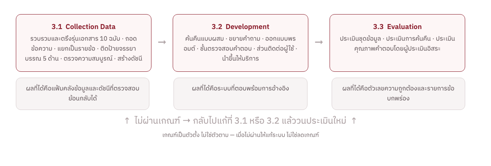
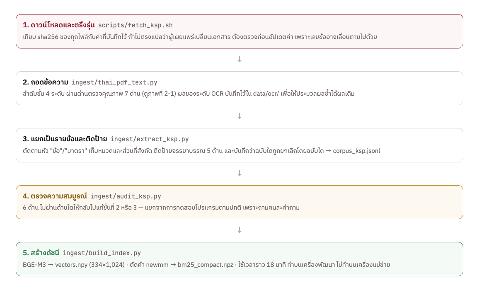
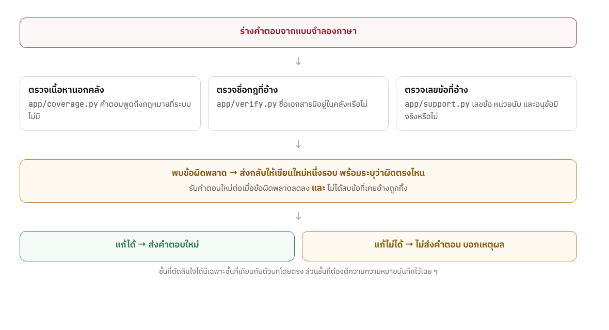
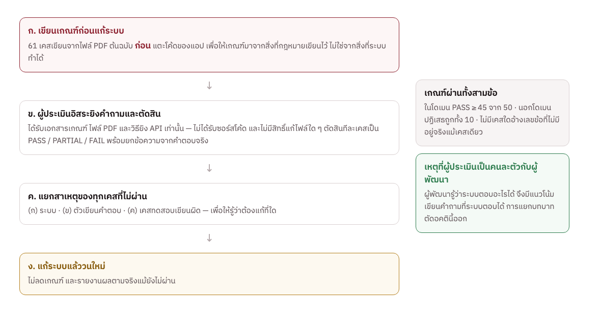

# บทที่ 3 ขั้นตอนและวิธีการดำเนินการวิจัย

การวิจัยเรื่อง การพัฒนาระบบแชทบอทตอบคำถามกฎหมายจรรยาบรรณวิชาชีพครู คณะครุศาสตร์อุตสาหกรรม มหาวิทยาลัยเทคโนโลยีพระจอมเกล้าพระนครเหนือ ผู้วิจัยได้จัดเตรียมเอกสารขั้นตอนและวิธีดำเนินงานวิจัย โดยเสนอตามหัวข้อต่อไปนี้

3.1  Collection Data
3.2  Development
3.3  Evaluation

> หมายเหตุถึงผู้เขียน (ลบก่อนส่ง): หัวข้อใหญ่สามหัวข้อนี้เป็นหัวข้อที่มีอยู่แล้วในเล่ม ส่วนเล่มตัวอย่างที่อาจารย์ให้มาใช้ห้าขั้นแบบ ADDIE คือ Analysis, Design, Development, Implementation & Testing และ Evaluation ถ้าอาจารย์ต้องการแบบห้าขั้น หัวข้อย่อยทั้งหมดย้ายกลุ่มได้โดยไม่ต้องเขียนใหม่ — 3.1.1 ถึง 3.1.3 คือ Analysis, 3.1.4 ถึง 3.1.6 กับ 3.2.1 ถึง 3.2.2 คือ Design, 3.2.3 ถึง 3.2.5 คือ Development, 3.2.6 ถึง 3.2.7 คือ Implementation และ 3.3 คือ Evaluation

กรอบแนวคิดของการดำเนินงานวิจัยแสดงในภาพที่ 3-1 โดยขั้นตอนทั้งสามไม่ได้เดินไปข้างหน้าอย่างเดียว แต่วนกลับได้ เมื่อผลการประเมินในขั้นที่ 3.3 ไม่ผ่านเกณฑ์ ผู้วิจัยจะกลับไปแก้ไขที่ขั้นที่ 3.1 หรือ 3.2 แล้วประเมินใหม่ทั้งชุด โดยไม่ลดเกณฑ์ลง

**ภาพที่  3-1  กรอบแนวคิดงานวิจัย**

## 3.1  Collection Data

ขั้นตอนการรวบรวมข้อมูลมีวัตถุประสงค์เพื่อให้ได้ฐานความรู้ (Knowledge Base) ที่ถูกต้อง ครบถ้วน และตรวจสอบย้อนกลับไปยังเอกสารต้นฉบับได้ เนื่องจากระบบนี้ตอบคำถามด้านกฎหมาย ความถูกต้องของคำตอบจึงถูกจำกัดด้วยคุณภาพของข้อมูลที่ป้อนเข้าระบบโดยตรง ขั้นตอนนี้ประกอบด้วย 6 ขั้นตอนย่อย ดังภาพที่ 3-2

**ภาพที่  3-2  ขั้นตอนการเตรียมชุดข้อมูลตั้งแต่เอกสารต้นฉบับจนถึงดัชนี**

### 3.1.1  การกำหนดขอบเขตและแหล่งข้อมูล

ผู้วิจัยกำหนดขอบเขตของเนื้อหาไว้ที่จรรยาบรรณวิชาชีพทางการศึกษาและกระบวนการที่เกี่ยวข้องเท่านั้น ได้แก่ จรรยาบรรณ 5 ด้าน แบบแผนพฤติกรรมตามจรรยาบรรณ การพิจารณาการประพฤติผิดจรรยาบรรณ และการอุทธรณ์คำวินิจฉัย โดยไม่รวมวินัยข้าราชการครู กฎหมายแรงงาน กฎหมายอาญา และกฎหมายภาษี ซึ่งเป็นคนละระบบกฎหมาย

การกำหนดขอบเขตให้แคบเช่นนี้เป็นการตัดสินใจเชิงออกแบบ ไม่ใช่ข้อจำกัด เพราะคำถามที่อันตรายที่สุดสำหรับระบบลักษณะนี้คือคำถามที่อยู่ใกล้ขอบเขตแต่อยู่นอกขอบเขต เช่น คำถามเรื่องโทษทางวินัยของข้าราชการครู ซึ่งระบบจะค้นเจอตัวบทจรรยาบรรณที่ดูเกี่ยวข้องและอาจตอบผิดได้ ผู้วิจัยจึงต้องรู้ขอบเขตของตนเองอย่างชัดเจนเพื่อปฏิเสธคำถามเหล่านี้

แหล่งข้อมูลหลักคือเว็บไซต์สำนักงานเลขาธิการคุรุสภา หมวดกฎหมายและข้อบังคับ (https://www.ksp.or.th/laws/) และเว็บไซต์ราชกิจจานุเบกษา รวมเอกสารทั้งสิ้น 10 ฉบับ ตามที่แสดงไว้แล้วในตารางที่ 2-1 ประกอบด้วยเอกสารที่ประกาศในราชกิจจานุเบกษา 7 ฉบับ และเอกสารที่เผยแพร่เฉพาะบนเว็บไซต์ของคุรุสภา 3 ฉบับ

ผู้วิจัยได้ตรวจสอบแล้วว่าเอกสารทั้งสิบฉบับนี้ไม่ปรากฏในชุดข้อมูลกฎหมายไทยแบบเปิดที่มีผู้รวบรวมไว้แล้ว จึงจำเป็นต้องดาวน์โหลดเป็นไฟล์ PDF และประมวลผลเองทั้งหมด ซึ่งเป็นที่มาของขั้นตอนในหัวข้อ 3.1.3

### 3.1.2  การดาวน์โหลดและการตรึงรุ่นของเอกสาร

ผู้วิจัยพัฒนาสคริปต์ fetch_ksp.sh สำหรับดาวน์โหลดเอกสารทั้งสิบฉบับ โดยบันทึกค่า sha256 ของไฟล์แต่ละฉบับ ณ วันที่ดาวน์โหลดไว้ในสคริปต์ และตรวจสอบทุกครั้งที่ดาวน์โหลดซ้ำ

เหตุผลของการตรึงรุ่นคือกฎหมายมีการแก้ไขเพิ่มเติม และผู้เผยแพร่อาจเปลี่ยนไฟล์ที่ URL เดิม โดยไม่เปลี่ยนชื่อไฟล์ หากค่า sha256 ไม่ตรงกับที่บันทึกไว้ แสดงว่าเอกสารถูกเปลี่ยน ผู้วิจัยต้องตรวจสอบว่าเปลี่ยนอะไรก่อนปรับค่าใหม่ เพราะการแก้ไขกฎหมายอาจทำให้เลขข้อเลื่อนตำแหน่ง ซึ่งจะทำให้การอ้างอิงของระบบผิดทั้งระบบโดยไม่มีสัญญาณเตือน

### 3.1.3  การถอดข้อความจากเอกสาร PDF

เอกสารต้นทางเป็นไฟล์ PDF ที่สร้างจากโปรแกรมประมวลผลคำรุ่นเก่าและไฟล์ที่ได้จากการสแกน ผู้วิจัยพบว่าไม่สามารถใช้วิธีดึงข้อความวิธีเดียวกับทุกฉบับได้ จึงพัฒนาโมดูล thai_pdf_text.py ที่ทำงานเป็นลำดับขั้น 4 ระดับ พร้อมด่านตรวจคุณภาพ 7 ด่าน ตามที่อธิบายไว้ในหัวข้อ 2.1.4 และภาพที่ 2-1

ผลของการรู้จำอักขระในระดับที่ 4 ถูกบันทึกเป็นไฟล์ข้อความไว้ในโฟลเดอร์ data/ocr/ เพื่อให้การประมวลผลซ้ำได้ผลเหมือนเดิมทุกครั้ง และเพื่อให้ผู้ที่ทำงานต่อบนระบบปฏิบัติการอื่นใช้ผลเดิมได้โดยไม่ต้องรู้จำอักขระใหม่

### 3.1.4  การแยกเป็นรายข้อและการติดป้าย

โมดูล extract_ksp.py ตัดข้อความที่ถอดได้ออกเป็นระเบียนรายข้อและรายมาตรา โดยจับหัวข้อจากรูปแบบ “ข้อ ๑” และ “มาตรา ๑” พร้อมเก็บหมวดและส่วนที่ข้อนั้นสังกัด ผลลัพธ์คือแฟ้ม corpus_ksp.jsonl จำนวน 334 ระเบียน จาก 324 ข้อและมาตรา โครงสร้างของระเบียนแสดงไว้ในภาพที่ 2-2

ขั้นตอนนี้มีการตัดสินใจเชิงออกแบบ 3 เรื่อง เรื่องแรกคือการเก็บหน่วยนับไว้เป็นฟิลด์แยก เพื่อให้ระบบแยกได้ว่าเอกสารฉบับใดใช้คำว่า “ข้อ” และฉบับใดใช้คำว่า “มาตรา” เรื่องที่สองคือการติดป้ายจรรยาบรรณ 5 ด้านให้กับข้อที่เกี่ยวข้อง เพื่อให้ระบบดึงข้อทั้งด้านมาตอบได้เมื่อคำถามเป็นการนับหรือแจกแจง และเรื่องที่สามคือการบันทึกความสัมพันธ์ว่าฉบับใดถูกยกเลิกโดยฉบับใด เพื่อไม่ให้ระบบหยิบฉบับที่ถูกยกเลิกแล้วมาตอบเป็นกฎที่ใช้อยู่

### 3.1.5  การตรวจสอบความสมบูรณ์ของชุดข้อมูล

ผู้วิจัยพัฒนาโปรแกรม audit_ksp.py ขึ้นแยกต่างหากจากการทดสอบโปรแกรมตามปกติ เนื่องจากทั้งสองอย่างตอบคนละคำถาม การทดสอบโปรแกรมตอบว่าโค้ดทำงานตามที่เขียนไว้หรือไม่ ส่วนการตรวจสอบชุดข้อมูลตอบว่าข้อมูลที่ได้ครบถ้วนตรงกับเอกสารต้นฉบับหรือไม่ ซึ่งโค้ดที่ทำงานถูกต้องทุกบรรทัดก็ยังผลิตชุดข้อมูลที่ขาดหายได้

**ตารางที่  3-1  รายการตรวจสอบความสมบูรณ์ของชุดข้อมูล**

| ด้านที่ตรวจ | สิ่งที่ตรวจ | เกณฑ์ผ่าน |
|:--|:--|:--|
| ความต่อเนื่องของเลขข้อ | เลขข้อในแต่ละฉบับเรียงต่อเนื่องไม่ขาดหาย | ไม่มีเลขข้อหายกลางฉบับ |
| หมวดและส่วน | ทุกข้อมีหมวดและส่วนที่สังกัดถูกต้อง | ไม่มีข้อที่สังกัดหมวดผิดประเภทผู้ประกอบวิชาชีพ |
| ป้ายจรรยาบรรณ | ข้อที่เป็นจรรยาบรรณถูกติดป้ายครบทั้ง 5 ด้าน | ครบทั้งห้าด้าน ไม่มีด้านใดว่าง |
| ความสัมพันธ์ของฉบับ | ฉบับที่ถูกยกเลิกชี้ไปยังฉบับที่มายกเลิกถูกต้อง | ตรงกับข้อความยกเลิกในตัวบท |
| ร่องรอยการถอดผิด | สระอำถูกแยก วรรณยุกต์หาย อักขระแปลกปลอม | ไม่พบร่องรอยทั้งสามชนิด |
| อัตราการเก็บเนื้อหา | สัดส่วนข้อความที่เก็บได้เทียบกับส่วนที่เป็นตัวบทจริง | ไม่ต่ำกว่าร้อยละ 85 ต่อฉบับ |

หากการตรวจสอบด้านใดไม่ผ่าน ผู้วิจัยจะกลับไปแก้ไขขั้นตอนการถอดข้อความหรือขั้นตอนการแยกรายข้อ แล้วสร้างชุดข้อมูลใหม่ทั้งชุด ไม่แก้ไขระเบียนเป็นรายตัว เพื่อให้ชุดข้อมูลสร้างซ้ำได้จากเอกสารต้นฉบับเสมอ

### 3.1.6  การสร้างดัชนีสำหรับการค้นคืน

โมดูล build_index.py สร้างดัชนี 2 ชุดจากชุดข้อมูลเดียวกัน ชุดแรกคือดัชนีเชิงความหมาย โดยแปลงข้อความของทุกระเบียนเป็นเวกเตอร์ขนาด 1,024 มิติด้วยแบบจำลอง BGE-M3 และชุดที่สองคือดัชนีเชิงคำ โดยตัดคำภาษาไทยด้วยอัลกอริทึม newmm แล้วสร้างเป็นดัชนี BM25

การสร้างดัชนีใช้เวลาประมาณ 18 นาที และต้องใช้แบบจำลองขนาด 2.2 กิกะไบต์ ผู้วิจัยจึงกำหนดให้ทำบนเครื่องพัฒนาเท่านั้น แล้วคัดลอกแฟ้มดัชนีไปใช้บนเครื่องแม่ข่าย ซึ่งจะกล่าวถึงในหัวข้อ 3.2.7

## 3.2  Development

ขั้นตอนการพัฒนามีวัตถุประสงค์เพื่อสร้างระบบที่ตอบคำถามจากชุดข้อมูลในหัวข้อ 3.1 พร้อมการอ้างอิงที่ตรวจสอบย้อนกลับได้ และปฏิเสธอย่างชัดเจนเมื่อไม่มีข้อมูลรองรับ ประกอบด้วย 7 ส่วน ดังนี้

### 3.2.1  สถาปัตยกรรมโดยรวมของระบบ

ระบบทำงานตามแนวทาง Retrieval-Augmented Generation ตามที่อธิบายไว้ในหัวข้อ 2.2.4 คือค้นตัวบทที่เกี่ยวข้องกับคำถามขึ้นมาก่อน แล้วจึงให้แบบจำลองภาษาเรียบเรียงคำตอบจากตัวบทเหล่านั้น ขั้นตอนการทำงานเต็มรูปแบบแสดงไว้ในภาพที่ 2-4 และส่วนประกอบทางเทคนิคแสดงไว้ในภาพที่ 2-8

ผู้วิจัยแบ่งโค้ดออกเป็นโมดูลตามหน้าที่ เพื่อให้ทดสอบแต่ละส่วนได้แยกจากกัน ได้แก่ โมดูลค้นคืน โมดูลขยายคำถาม โมดูลเรียบเรียงคำตอบ โมดูลตรวจสอบคำตอบ 3 โมดูล และโมดูลส่วนติดต่อผู้ใช้ 2 ช่องทาง

### 3.2.2  การค้นคืนแบบผสมและการปรับค่าพารามิเตอร์

ระบบค้นคืนด้วย BM25 และการค้นด้วยเวกเตอร์ควบคู่กัน แล้วรวมอันดับด้วยวิธี Reciprocal Rank Fusion ตามที่อธิบายไว้ในหัวข้อ 2.4.3 ค่าพารามิเตอร์ที่ต้องกำหนดและวิธีที่ได้มาแสดงในตารางที่ 3-2

**ตารางที่  3-2  ค่าพารามิเตอร์ของระบบค้นคืนและที่มาของค่า**

| พารามิเตอร์ | ค่าที่ใช้ | ที่มาของค่า |
|:--|:--|:--|
| จำนวนตัวบทที่ส่งให้แบบจำลอง | 8 ข้อ | ปรับจาก 6 หลังพบว่าคำถามประเภทนับจำนวนได้ข้อไม่ครบ |
| ค่าคงที่ k ของ RRF | 60 | ค่าที่ใช้กันทั่วไปในงานที่อ้างอิง |
| เกณฑ์ค่าความคล้ายต่ำสุด | 0.46 | ปรับด้วย ingest/calibrate.py จากชุดคำถามประเมิน 65 คำถาม |
| น้ำหนักของสองระบบค้นคืน | 1.0 : 1.0 | ปรับด้วย ingest/tune_fusion.py โดยวัดจากชุดคำถามเดียวกัน |
| อุณหภูมิของแบบจำลองภาษา | 0 | เพื่อให้คำตอบของคำถามเดียวกันคงเส้นคงวาที่สุดเท่าที่ทำได้ |

ชุดคำถามที่ใช้ปรับค่าเป็นคนละชุดกับชุดที่ใช้ประเมินผลในหัวข้อ 3.3.3 เพื่อไม่ให้ค่าที่ปรับไว้ถูกปรับเข้าหาเคสทดสอบโดยตรง ซึ่งจะทำให้ผลการประเมินสูงเกินจริง

### 3.2.3  การขยายคำถามด้วยคำเรียกแทนและคำพ้องความหมาย

ผู้วิจัยพบตั้งแต่ขั้นทดลองว่าภาษาที่ผู้ใช้ใช้กับภาษาที่กฎหมายใช้ห่างกันมาก จึงพัฒนาโมดูล query_expand.py ซึ่งเก็บตารางกฎในรูปแบบคำที่ผู้ใช้พิมพ์คู่กับคำศัพท์ทางกฎหมายที่ต้องเติม ตามที่อธิบายไว้ในหัวข้อ 2.6.2 และภาพที่ 2-7 โดยเติมคำเข้าไปโดยไม่ลบคำเดิมของผู้ใช้

### 3.2.4  การออกแบบพรอมต์

พรอมต์ของระบบประกอบด้วยข้อกำหนด 18 ข้อ แบ่งเป็น 4 กลุ่มตามที่อธิบายไว้ในหัวข้อ 2.5.2 ได้แก่ ขอบเขตของแหล่งข้อมูล ความถูกต้องของการอ้างอิง ความซื่อตรงต่อถ้อยคำของกฎหมาย และความถูกต้องของกลุ่มผู้ประกอบวิชาชีพ

ข้อกำหนดแต่ละข้อไม่ได้เขียนขึ้นล่วงหน้าทั้งหมด แต่ทยอยเพิ่มจากข้อผิดพลาดที่พบในการประเมินแต่ละรอบ เช่น ข้อกำหนดเรื่องการแยกกลุ่มผู้ประกอบวิชาชีพเพิ่มขึ้นหลังพบว่าระบบตอบคำถามเรื่องครูด้วยข้อของผู้บริหารการศึกษา

### 3.2.5  ชั้นตรวจสอบคำตอบ

เนื่องจากแบบจำลองภาษาอาจสร้างข้อความที่อ่านน่าเชื่อถือแต่ไม่มีอยู่ในตัวบท ตามที่อธิบายไว้ในหัวข้อ 2.3.2 ผู้วิจัยจึงเพิ่มชั้นตรวจสอบที่ทำงานด้วยกฎหลังจากแบบจำลองสร้างคำตอบแล้ว ดังภาพที่ 3-3

**ภาพที่  3-3  ชั้นตรวจสอบคำตอบและการส่งกลับไปเขียนใหม่**

หลักการออกแบบมี 2 ข้อ ข้อแรกคือชั้นที่ตัดสินใจระงับคำตอบได้ต้องเป็นชั้นที่เทียบกับตัวบทโดยตรงเท่านั้น เช่น เลขข้อนั้นมีอยู่จริงหรือไม่ ส่วนชั้นที่ต้องตีความความหมายจะบันทึกผลไว้เพื่อการวิเคราะห์ แต่ไม่ให้ตัดสินใจ เพราะการระงับคำตอบที่ถูกต้องเสียหายมากกว่า

ข้อที่สองคือเมื่อพบข้อผิดพลาด ระบบจะส่งคำตอบกลับไปให้แบบจำลองเขียนใหม่หนึ่งรอบ พร้อมระบุว่าผิดตรงไหน แทนการทิ้งคำตอบทันที และจะรับคำตอบใหม่ต่อเมื่อข้อผิดพลาดลดลง และไม่ได้ลบข้อที่เคยอ้างถูกต้องทิ้งไป เงื่อนไขข้อหลังเพิ่มขึ้นหลังพบว่าแบบจำลองแก้ปัญหาด้วยการลบการอ้างอิงที่ถูกทักทิ้ง ซึ่งทำให้คำตอบตรวจสอบไม่ได้

### 3.2.6  ส่วนติดต่อผู้ใช้

ระบบให้บริการ 2 ช่องทาง ช่องทางหลักคือแอปพลิเคชัน LINE ผ่าน LINE Messaging API เนื่องจากกลุ่มผู้ใช้เป้าหมายใช้อยู่แล้วโดยไม่ต้องติดตั้งโปรแกรมเพิ่ม และช่องทางที่สองคือหน้าเว็บสำหรับผู้ที่ไม่สะดวกใช้ LINE และสำหรับการทดสอบในขั้นพัฒนา ทั้งสองช่องทางเรียกใช้เครื่องแม่ข่ายเดียวกันจึงให้คำตอบตรงกันเสมอ ตัวอย่างการใช้งานแสดงไว้ในภาพที่ 2-6

### 3.2.7  การนำระบบขึ้นให้บริการ

ผู้วิจัยบรรจุระบบเป็นอิมเมจ Docker และนำขึ้นให้บริการบนแพลตฟอร์ม Render ภายใต้ข้อจำกัดหน่วยความจำ 512 เมกะไบต์ ซึ่งเป็นข้อจำกัดที่กำหนดการออกแบบหลายจุด ตามที่อธิบายไว้ในหัวข้อ 2.7.2 และ 2.7.5

ดัชนีที่สร้างไว้ในหัวข้อ 3.1.6 ถูกคัดลอกเข้าไปในอิมเมจโดยตรง ไม่สร้างใหม่ตอนติดตั้ง และในขั้นให้บริการระบบเรียกใช้บริการแปลงข้อความเป็นเวกเตอร์จากภายนอกที่ใช้แบบจำลองชุดเดียวกัน เพื่อให้เวกเตอร์ของคำถามอยู่ในปริภูมิเดียวกับดัชนีที่สร้างไว้

## 3.3  Evaluation

ขั้นตอนการประเมินแบ่งเป็น 3 ระดับ ตามสิ่งที่ต้องการวัด ได้แก่ การประเมินชุดข้อมูล การประเมินการค้นคืน และการประเมินคุณภาพคำตอบ การแยกเป็นสามระดับทำให้ผู้วิจัยระบุได้ว่าเมื่อคำตอบผิด ความผิดพลาดเกิดที่ขั้นตอนใด ซึ่งจำเป็นต่อการแก้ไขให้ถูกจุด

### 3.3.1  การประเมินชุดข้อมูล

ใช้โปรแกรม audit_ksp.py ตามรายการตรวจสอบ 6 ด้านในตารางที่ 3-1 ผลการตรวจสอบนี้เป็นเงื่อนไขก่อนเข้าสู่การประเมินระดับถัดไป เพราะถ้าชุดข้อมูลไม่ครบ การวัดความถูกต้องของคำตอบจะวัดสิ่งผิด

### 3.3.2  การประเมินการค้นคืน

ผู้วิจัยสร้างชุดคำถามประเมินจำนวน 65 คำถาม เก็บไว้ในแฟ้ม ksp_questions.jsonl แต่ละคำถามระบุข้อที่ถือว่าเป็นคำตอบที่ถูกต้อง (gold_ids) ไว้ล่วงหน้า แล้ววัดว่าระบบค้นข้อนั้นขึ้นมาอยู่ในลำดับที่ส่งให้แบบจำลองหรือไม่

การประเมินระดับนี้แยกจากการประเมินคุณภาพคำตอบโดยเจตนา เพราะความผิดพลาดของระบบแบ่งได้เป็นสองชนิดที่ต้องแก้คนละวิธี ชนิดแรกคือระบบค้นข้อที่ถูกต้องไม่เจอ ซึ่งต้องแก้ที่การค้นคืนหรือการขยายคำถาม และชนิดที่สองคือระบบค้นเจอแล้วแต่เรียบเรียงคำตอบผิด ซึ่งต้องแก้ที่พรอมต์หรือชั้นตรวจสอบ

### 3.3.3  การประเมินคุณภาพคำตอบ

การประเมินระดับนี้เป็นการประเมินหลักของงานวิจัย ผู้วิจัยจัดทำเอกสารเกณฑ์รับคำตอบ (Acceptance Test) จำนวน 61 เคส โดยเขียนขึ้นจากไฟล์ PDF ต้นฉบับก่อนการแก้ไขโค้ดของระบบ เพื่อให้เกณฑ์มาจากสิ่งที่กฎหมายเขียนไว้ ไม่ใช่จากสิ่งที่ระบบทำได้ ขั้นตอนแสดงในภาพที่ 3-4

**ภาพที่  3-4  ขั้นตอนการประเมินคุณภาพคำตอบและการวนปรับปรุง**

เคสทดสอบแบ่งเป็น 2 กลุ่ม กลุ่มแรกคือเคสในโดเมนจำนวน 50 เคส ซึ่งเป็นคำถามที่ชุดข้อมูลตอบได้ และกลุ่มที่สองคือเคสนอกโดเมนจำนวน 10 เคส ซึ่งเป็นคำถามที่ชุดข้อมูลตอบไม่ได้และระบบต้องปฏิเสธ โดยแต่ละเคสระบุไว้ 3 อย่าง คือคำถาม ข้อที่คำตอบต้องอ้างถึง และสิ่งที่คำตอบต้องมีหรือต้องไม่มี

ผู้วิจัยกำหนดให้ผู้ประเมินเป็นคนละฝ่ายกับผู้พัฒนาระบบ โดยผู้ประเมินได้รับเพียงสามอย่าง คือเอกสารเกณฑ์ ไฟล์ PDF ต้นฉบับ และวิธียิงคำถามเข้าระบบ แต่ไม่ได้รับซอร์สโค้ดและไม่มีสิทธิ์แก้ไขไฟล์ใด ๆ เหตุผลคือผู้พัฒนาทราบว่าระบบตอบอะไรได้ จึงมีแนวโน้มประเมินเข้าข้างระบบโดยไม่ตั้งใจ การแยกบทบาทจึงตัดอคตินี้ออกไป

**ตารางที่  3-3  เกณฑ์การตัดสินผลของแต่ละเคส**

| ผลการตัดสิน | ความหมาย |
|:--|:--|
| PASS | คำตอบถูกต้อง อ้างข้อครบตามที่เคสกำหนด และไม่มีสิ่งที่เคสห้ามไว้ |
| PARTIAL | คำตอบถูกบางส่วน เช่น อธิบายถูกแต่อ้างเลขข้อผิด หรือตอบไม่ครบทุกข้อ |
| FAIL | คำตอบผิด ปฏิเสธทั้งที่ตอบได้ หรืออ้างข้อที่ไม่มีอยู่จริง |

เคสที่ก้ำกึ่งให้ตัดสินเป็น FAIL ไว้ก่อน และทุกเคสต้องมีการยกข้อความจากคำตอบจริงมาประกอบการตัดสิน เพื่อให้ผลการประเมินตรวจสอบย้อนกลับได้

เกณฑ์ผ่านของทั้งระบบกำหนดไว้ 3 ข้อ ตามตารางที่ 3-4 โดยกำหนดไว้ตั้งแต่ก่อนการประเมินรอบแรก และห้ามแก้ไขเพื่อให้ผ่าน

**ตารางที่  3-4  เกณฑ์ผ่านของระบบ**

| เกณฑ์ | ค่าที่ต้องได้ |
|:--|:--|
| เคสในโดเมน | PASS อย่างน้อย 45 จาก 50 เคส |
| เคสนอกโดเมน | PASS ทั้ง 10 เคส ปฏิเสธพลาดแม้เคสเดียวถือว่าไม่ผ่าน |
| ความถูกต้องของการอ้างอิง | ต้องไม่มีเคสใดที่ระบบอ้างเลขข้อหรือเลขมาตราที่ไม่มีอยู่จริง แม้แต่เคสเดียว |

### 3.3.4  การแยกสาเหตุและการวนปรับปรุง

ทุกเคสที่ไม่ได้ผล PASS ผู้ประเมินต้องระบุสาเหตุเป็นหนึ่งใน 3 ประเภท ได้แก่ (ก) ความผิดพลาดของระบบ เช่น ค้นคืนไม่เจอ หรือชั้นตรวจสอบทำงานผิด (ข) ความผิดพลาดของการเรียบเรียงคำตอบ ทั้งที่ระบบค้นข้อที่ถูกต้องมาให้แล้ว และ (ค) เคสทดสอบเขียนผิดตั้งแต่แรก

การแยกสาเหตุเช่นนี้ทำให้ทราบว่าควรแก้ที่ใด และทำให้เห็นได้ว่าการแก้ไขในรอบถัดไปได้ผลจริงหรือไม่ เมื่อผลการประเมินยังไม่ผ่านเกณฑ์ ผู้วิจัยจะแก้ไขระบบแล้วประเมินใหม่ทั้ง 61 เคส ไม่ประเมินเฉพาะเคสที่แก้ เพื่อให้เห็นว่าการแก้ไขทำให้เคสอื่นเสียหายหรือไม่

ผู้วิจัยบันทึกผลการประเมินทุกรอบไว้เป็นตารางเปรียบเทียบ ทั้งจำนวนเคสที่ผ่าน จำนวนเคสที่ถอยหลังจากรอบก่อน และสัดส่วนของสาเหตุทั้งสามประเภท ผลของการประเมินทุกรอบรายงานไว้ในบทที่ 4

### 3.3.5  การทดสอบโปรแกรมและเครื่องมือวัดเสริม

นอกจากการประเมินคุณภาพคำตอบ ผู้วิจัยเขียนชุดทดสอบโปรแกรมอัตโนมัติจำนวน 383 การทดสอบ ครอบคลุมการถอดข้อความ การแยกรายข้อ การตัดคำ การค้นคืน การตรวจสอบคำตอบ และส่วนติดต่อผู้ใช้ โดยทุกการทดสอบต้องผ่านก่อนนำระบบเข้าสู่การประเมิน

ผู้วิจัยยังพัฒนาเครื่องมือ flag_rate.py สำหรับวัดอัตราการแจ้งเตือนผิดพลาดของชั้นตรวจสอบคำตอบ โดยยิงคำถามจริงเข้าระบบแล้วนับว่าชั้นตรวจสอบแจ้งเตือนกี่ครั้ง และในจำนวนนั้นเป็นการแจ้งเตือนที่ถูกต้องกี่ครั้ง เครื่องมือนี้จำเป็นเพราะชั้นตรวจสอบที่แจ้งเตือนผิดบ่อยจะทำให้ระบบระงับคำตอบที่ถูกต้อง ซึ่งเสียหายกว่าการไม่ตรวจเลย
